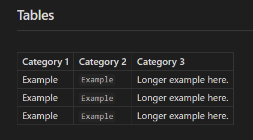
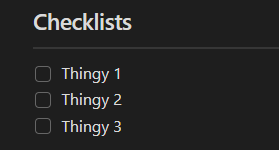
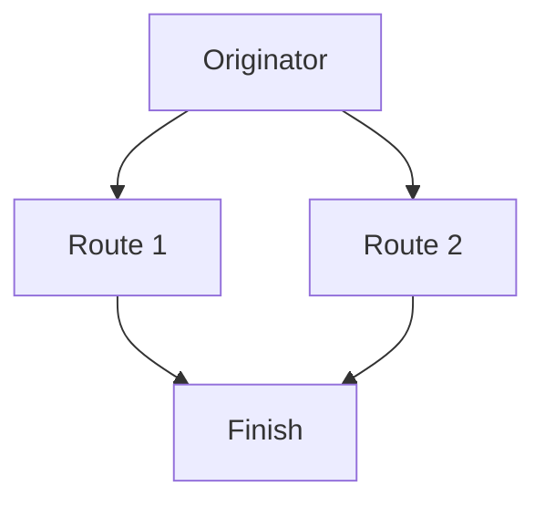
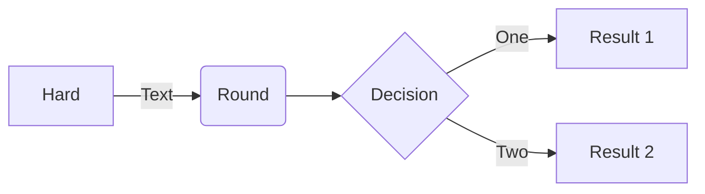
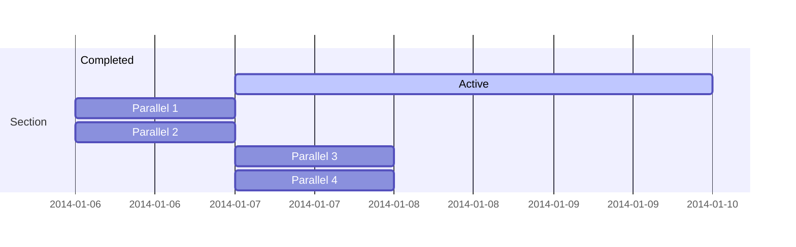
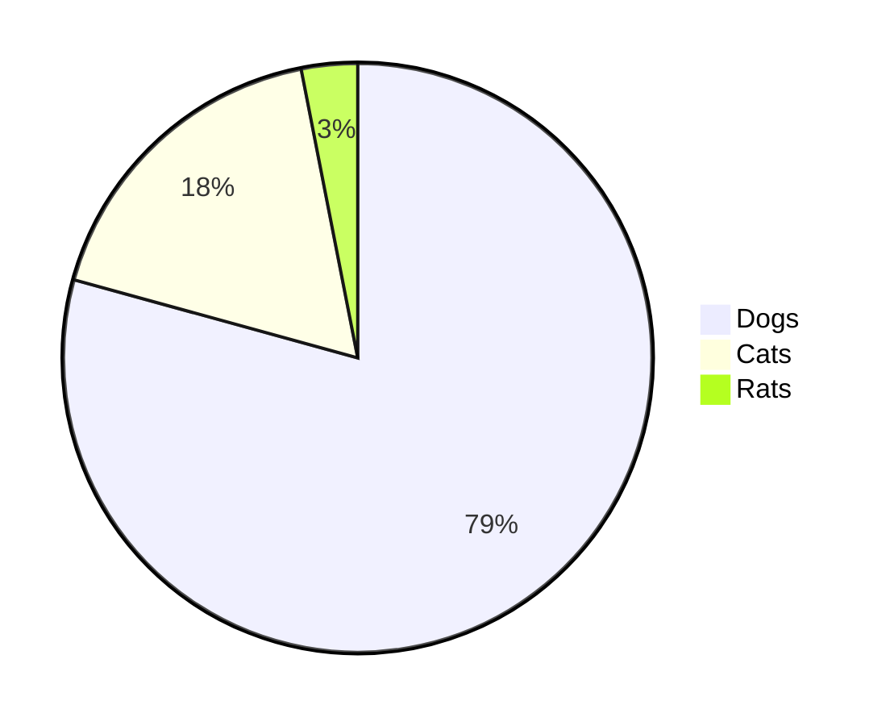
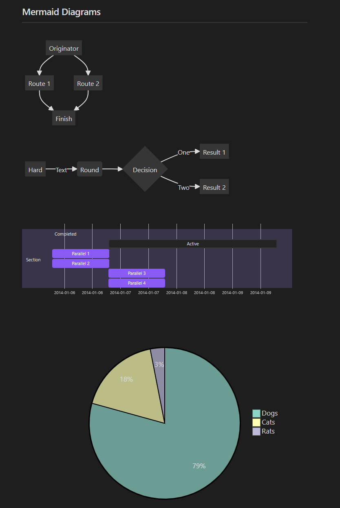
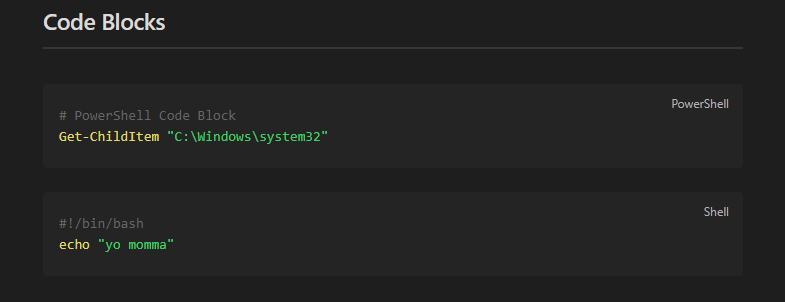

# What Obsidian Features Work in mdBook?
- This is a simple file containing a handful of different Obsidian markdown features to have a visual comparison of how formatting carries over.
	- This is assuming no fancy pre-processors are being used; strictly default settings.

### Tables
---
**mdBook Version:**

| Category 1 | Category 2 | Category 3 |
| --- | --- | --- |
| Example | ``Example`` | Longer example here. | 
| Example | ``Example`` | Longer example here. | 
| Example | ``Example`` | Longer example here. | 


**Obsidian Version:**



### Checklists
---
**mdBook Version:**

- [ ] Thingy 1
- [ ] Thingy 2
- [ ] Thingy 3

**Obsidian Version:**




### Message Blocks (Callouts)
---
**mdBook Version (Part 1):**

> [!info]
> Information here.
> Alises: N/A

> [!todo]
> To-do list here.
> Alises: N/A

> [!tip]
> Important info here!
> Aliases: ``hint``, ``important``

>[!success]
>Success here!
> Aliases: ``check``, ``done``

> [!question]
> Freqently asked questions!
> Aliases: ``help``, ``faq``

**Obsidian Version (Part 1):**


**mdBook Version (Part 2):**

>[!warning]
> Warning here!
> Aliases: ``caution``, ``attention``

>[!failure]
> Failure here!
> Aliases: ``fail``, ``missing``

> [!danger]
> Bruh!!!
> Aliases: N/A

> [!bug]
> Known bugs here!
> Aliases: N/A

> [!example]
> Example here!
> Aliases: N/A

> [!quote]
> Quote here!
> Aliases: N/A


**Obsidian Version (Part 2):**


### Mermaid Diagrams
---
**mdBook Version:**










**Obsidian Version:**



### Code Blocks
---
**mdBook Version:**

```powershell
# PowerShell Code Block
Get-ChildItem "C:\Windows\system32"
```

```shell
#!/bin/bash
echo "yo momma"
```

**Obsidian Version:**

