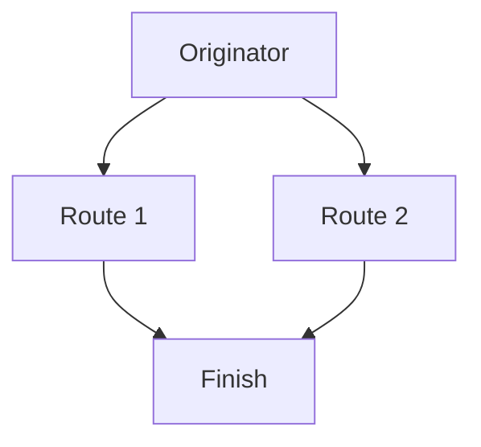
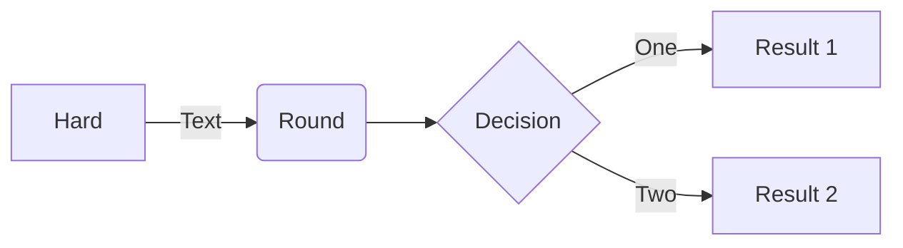
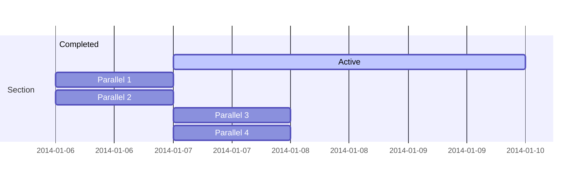
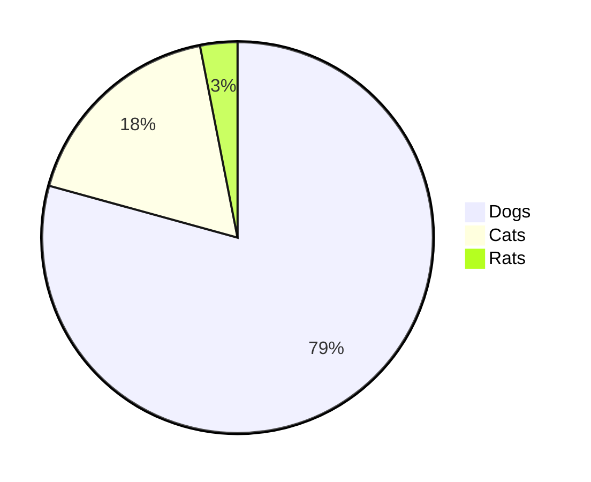

# What Obsidian Features Work in mdBook?

### Tables
---

| Category 1 | Category 2 | Category 3 |
| --- | --- | --- |
| Example | ``Example`` | Longer example here. | 
| Example | ``Example`` | Longer example here. | 
| Example | ``Example`` | Longer example here. | 

### Checklists
---
- [ ] Thingy 1
- [ ] Thingy 2
- [ ] Thingy 3

### Message Blocks (Callouts)
---

> [!info]
> Information here.
> Alises: N/A

> [!todo]
> To-do list here.
> Alises: N/A

> [!tip]
> Important info here!
> Aliases: ``hint``, ``important``

>[!success]
>Success here!
> Aliases: ``check``, ``done``

> [!question]
> Freqently asked questions!
> Aliases: ``help``, ``faq``

>[!warning]
> Warning here!
> Aliases: ``caution``, ``attention``

>[!failure]
> Failure here!
> Aliases: ``fail``, ``missing``

> [!danger]
> Bruh!!!
> Aliases: N/A

> [!bug]
> Known bugs here!
> Aliases: N/A

> [!example]
> Example here!
> Aliases: N/A

> [!quote]
> Quote here!
> Aliases: N/A

**Example:**

> [!question]- Guess what?
> > [!example] Callouts can be renamed...
> > > [!tip] ... and nested!

### Mermaid Diagrams
---

